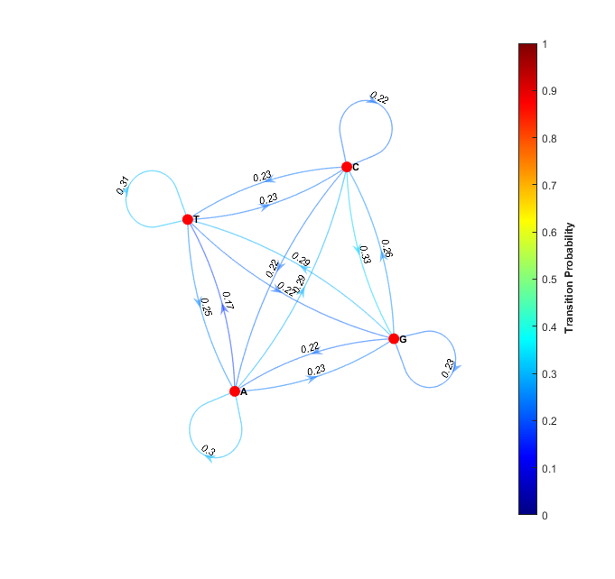

# genome-markov-chain-generator
MATLAB code for generating and plotting the Markov Chain/Trasition Matrix for a given genome

pre-set example is vibrio colerae's DNA.

works for .txt files with only 'A', 'T', 'C', 'G' nucleotides.

# EXAMPLE:

